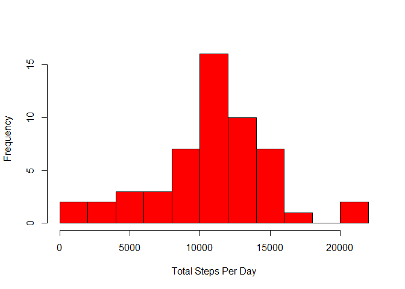
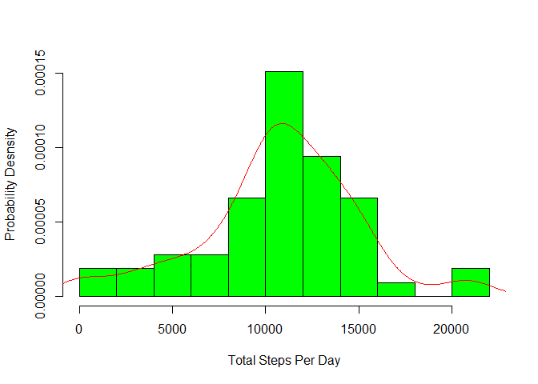
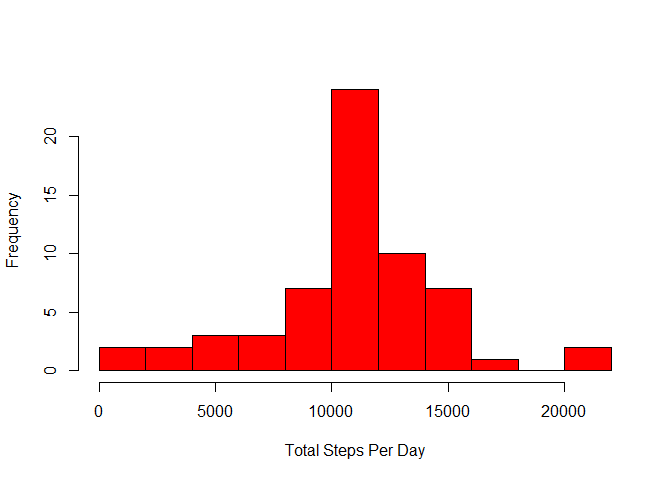
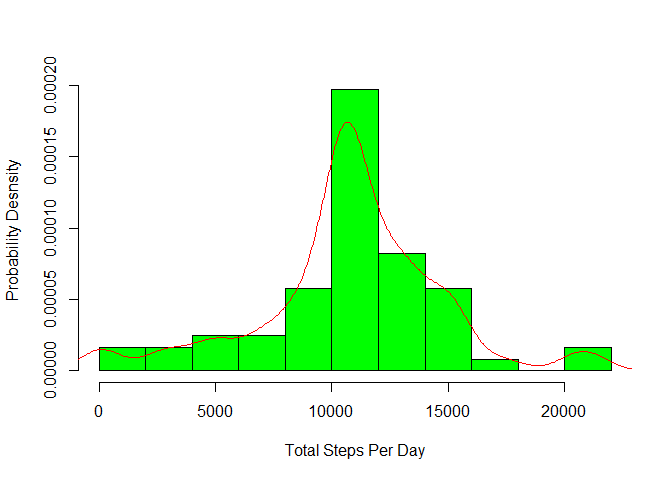

### Loading and preprocessing the data

**1. Load the data**

    data<-read.csv("activity.csv",sep=",")
    head(data)

    ##   steps       date interval
    ## 1    NA 2012-10-01        0
    ## 2    NA 2012-10-01        5
    ## 3    NA 2012-10-01       10
    ## 4    NA 2012-10-01       15
    ## 5    NA 2012-10-01       20
    ## 6    NA 2012-10-01       25

**2. Process/transform the data**

    class(data$date)

    ## [1] "factor"

    data$date<-as.Date(as.character(data$date))
    class(data$date)

    ## [1] "Date"

### What is mean total number of steps taken per day?

For this part of the assignment, you can ignore the missing values in
the dataset.

**1. Calculate the total number of steps taken per day**

    stepsTotal<-aggregate(formula=steps~date,data=data,FUN=sum,na.rm=TRUE)
    head(stepsTotal)

    ##         date steps
    ## 1 2012-10-02   126
    ## 2 2012-10-03 11352
    ## 3 2012-10-04 12116
    ## 4 2012-10-05 13294
    ## 5 2012-10-06 15420
    ## 6 2012-10-07 11015

**2. Make a histogram of the total number of steps taken each day**

    hist(stepsTotal$steps,10,col="red",xlab="Total Steps Per Day",main=NULL)

    hist(stepsTotal$steps,col="green",ylab="Probability Desnsity",xlab="Total Steps Per Day",main=NULL,freq=FALSE,10)
    density<-density(stepsTotal$steps)
    points(density$x,density$y,"l",col="red")

 As
we can see from the graph we a distribution close to the normal
distribution

**3. Calculate and report the mean and median of the total number of
steps taken per day**

    mean(stepsTotal$steps)

    ## [1] 10766.19

    median(stepsTotal$steps)

    ## [1] 10765

### What is the average daily activity pattern?

**1. Make a time series plot (i.e. type = "l") of the 5-minute interval
(x-axis) and the average number of steps taken, averaged across all days
(y-axis)**

    meanStepsPerInterval<-aggregate(steps~interval,data=data,FUN=mean)
    plot(meanStepsPerInterval$interval,meanStepsPerInterval$steps,"l",
         xlab="interval",ylab="steps")

**2. Which 5-minute interval, on average across all the days in the
dataset, contains the maximum number of steps?**

    meanStepsPerInterval$interval[which.max(meanStepsPerInterval$steps)]

    ## [1] 835

### Imputing missing values

**1. Calculate and report the total number of missing values in the
dataset (i.e. the total number of rows with NAs)**

    length(which(is.na(data)))

    ## [1] 2304

**2. Devise a strategy for filling in all of the missing values in the
dataset. The strategy does not need to be sophisticated. For example,
you could use the mean/median for that day, or the mean for that
5-minute interval, etc.**

Here we replace NAs with the mean for the respective 5 minute interval

    newdata<-data
    meanPerInterval<-aggregate(steps~interval,data=data,FUN=mean,na.rm=TRUE)
    newdata<-merge(newdata,meanPerInterval,by.x="interval",by.y="interval")

    for (i in 1:length(newdata$steps.x)){
        if(is.na(newdata$steps.x[i])) newdata$steps.x[i]<-newdata$steps.y[i]
    } 

**3. Create a new dataset that is equal to the original dataset but with
the missing data filled in.**

new data

    newdata<-newdata[,1:3]        
    names(newdata)[2]<-"steps" 
    str(newdata)

    ## 'data.frame':    17568 obs. of  3 variables:
    ##  $ interval: int  0 0 0 0 0 0 0 0 0 0 ...
    ##  $ steps   : num  1.72 0 0 0 0 ...
    ##  $ date    : Date, format: "2012-10-01" "2012-11-23" ...

old data

    str(data)

    ## 'data.frame':    17568 obs. of  3 variables:
    ##  $ steps   : int  NA NA NA NA NA NA NA NA NA NA ...
    ##  $ date    : Date, format: "2012-10-01" "2012-10-01" ...
    ##  $ interval: int  0 5 10 15 20 25 30 35 40 45 ...

**4. Make a histogram of the total number of steps taken each day and
Calculate and report the mean and median total number of steps taken per
day. Do these values differ from the estimates from the first part of
the assignment? What is the impact of imputing missing data on the
estimates of the total daily number of steps?**

    totalStepsPerDay<-aggregate(steps~date,data=newdata,FUN=sum)
    hist(totalStepsPerDay$steps,col="red",10,main=NULL,xlab="Total Steps Per Day")

    hist(totalStepsPerDay$steps,col="green",ylab="Probability Desnsity",xlab="Total Steps Per Day",main=NULL,freq=FALSE,10)
    density<-density(totalStepsPerDay$steps)
    points(density$x,density$y,"l",col="red")

    mean(totalStepsPerDay$steps)

    ## [1] 10766.19

    median(totalStepsPerDay$steps)

    ## [1] 10766.19

Because we added mean values of steps, we have a probability
distribution which is very close to a more narrow normal
distribution(smaller standard deviation) than the one in question
one.Also now the median and the mean of this distribution are even (as
it should be in a normal distribution).

### Are there differences in activity patterns between weekdays and weekends?

For this part the weekdays() function may be of some help here. Use the
dataset with the filled-in missing values for this part.

**1. Create a new factor variable in the dataset with two levels -
"weekday" and "weekend" indicating whether a given date is a weekday or
weekend day.**

    options(warn=-1)
    newdata$day<-weekdays(newdata$date)
    newdata$day<-factor(newdata$day,levels=c("Monday","Tuesday","Wednesday","Thursday"
                                            ,"Friday","Saturday","Sunday"),
                       labels=c("Weekday","Weekday","Weekday","Weekday","Weekday",
                                "Weekend","Weekend"))

**2. Make a panel plot containing a time series plot (i.e. type = "l")
of the 5-minute interval (x-axis) and the average number of steps taken,
averaged across all weekday days or weekend days (y-axis). See the
README file in the GitHub repository to see an example of what this plot
should look like using simulated data.**

    newdata$day<-as.character(newdata$day)
    y<-aggregate(steps~interval+day,data=newdata,FUN=mean)
    library(ggplot2)
    y$day<-as.factor(y$day)
    qplot(x=interval,y=steps,data=y,geom="line",facets=day~.)

